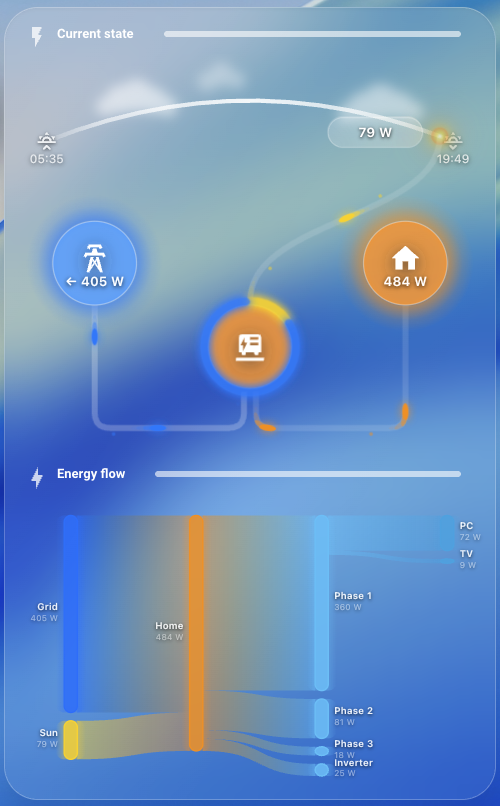
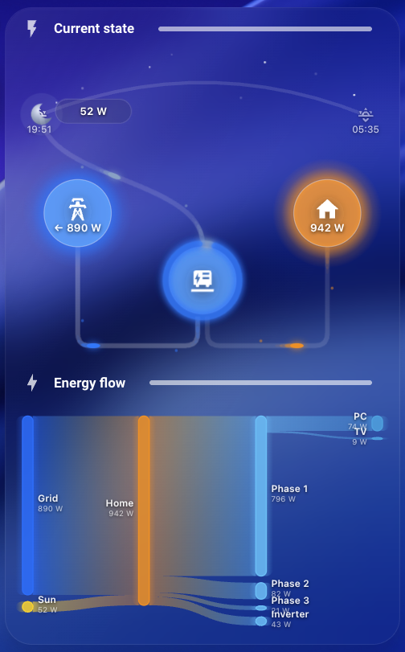

# Solar Arc Card

<p align="center">
  
  &nbsp;&nbsp;
  
</p>

Custom Lovelace card for Home Assistant that combines two visualizations in one:

- **Arc** — animated solar arc showing sun position across the sky, real-time PV production, grid flow, and house consumption with animated energy particles
- **Sankey** — fully configurable energy flow diagram showing how power moves between sources and consumers

---

## Features

- Sun/moon arc with real-time position based on the built-in `sun.sun` entity
- Animated energy flow particles (solar → inverter → grid / house)
- Inverter ring chart showing solar vs. grid-import ratio
- Day/night mode with clouds, stars, moon and pill label
- Glassmorphism card design
- Fully configurable Sankey diagram with unlimited sections and entities
- Sankey supports **horizontal** and **vertical** layout
- Customizable section separators (icon, color, text)
- Full color theming for arc nodes, flows, glows and ring
- Each section (arc / sankey) can be independently shown or hidden

---

## Installation

### HACS (recommended)

1. Open HACS in Home Assistant
2. Click the three-dot menu → **Custom repositories**
3. Add `https://github.com/martinargalas/ha-solar-arc-card` with category **Lovelace**
4. Find **Solar Arc Card** in the list and click **Download**
5. Go to **Settings → Dashboards → Manage resources** and add:
   - URL: `/hacsfiles/ha-solar-arc-card/solar-arc-card.js`
   - Type: **JavaScript Module**
6. Reload the browser

### Manual

1. Copy `solar-arc-card.js` to `/config/www/solar-arc-card.js`
2. Go to **Settings → Dashboards → Manage resources** and add:
   - URL: `/local/solar-arc-card.js`
   - Type: **JavaScript Module**
3. Reload the browser

---

## Configuration

### Minimal

```yaml
type: custom:solar-arc-card

arc:
  solar_production: sensor.pv_production_power
  house_consumption: sensor.home_consumption_power
  grid_power: sensor.grid_active_power
```

### Full example

```yaml
type: custom:solar-arc-card

arc:
  solar_production: sensor.pv_production_power
  house_consumption: sensor.home_consumption_power
  grid_power: sensor.grid_active_power

  arc_show: true
  arc_title_show: true
  arc_title_icon_show: true
  arc_title_text: "Current State"

  style:
    arc_title_icon: mdi:flash
    arc_title_icon_color: "#FFD60A"
    arc_title_text_color: ""
    arc_text_color: ""
    arc_icon_color: ""
    arc_inverter_color: ""
    arc_grid_color: ""
    arc_home_color: ""
    arc_inactive_color: ""
    arc_sun_flow_color: ""
    arc_moon_flow_color: ""

sankey:
  sankey_show: true
  layout: horizontal
  sankey_title_show: true
  sankey_title_icon_show: true
  sankey_title_text: "Energy Flow"

  style:
    sankey_title_icon: mdi:lightning-bolt
    sankey_title_icon_color: ""
    sankey_title_text_color: ""
    sankey_text_color_primary: ""
    sankey_text_color_secondary: ""

  sections:
    - entities:
        - entity_id: sensor.grid_import_power
          name: Grid
          color: "#007AFF"
          children:
            - sensor.home_consumption_power
        - entity_id: sensor.pv_production_power
          name: Solar
          color: "#FFD60A"
          children:
            - sensor.home_consumption_power
            - sensor.grid_export_power
    - entities:
        - entity_id: sensor.home_consumption_power
          name: Home
          color: "#FF9500"
          children:
            - sensor.floor1_consumption_power
            - sensor.floor2_consumption_power
            - sensor.floor3_consumption_power
        - entity_id: sensor.grid_export_power
          type: remaining_parent_state
          name: Grid export
          color: "#30D158"
    - entities:
        - entity_id: sensor.floor1_consumption_power
          name: Floor 1
          color: "#5AC8FA"
        - entity_id: sensor.floor2_consumption_power
          name: Floor 2
          color: "#5AC8FA"
        - entity_id: sensor.floor3_consumption_power
          name: Floor 3
          color: "#5AC8FA"
```

---

## Options reference

### `arc` block

| Option | Type | Default | Description |
|--------|------|---------|-------------|
| `solar_production` | string | — | PV production sensor |
| `house_consumption` | string | — | House consumption sensor |
| `grid_power` | string | — | Grid power sensor (positive = export, negative = import) |
| `arc_show` | boolean | `true` | Show/hide the entire arc section |
| `arc_title_show` | boolean | `true` | Show/hide the separator bar above arc |
| `arc_title_icon_show` | boolean | `true` | Show/hide the separator icon |
| `arc_title_text` | string | `Current State` | Separator label text |

### `arc.style` block

| Option | Type | Default | Description |
|--------|------|---------|-------------|
| `arc_title_icon` | string | `mdi:flash` | MDI icon for the separator |
| `arc_title_icon_color` | string | `""` | Separator icon color (empty = theme default) |
| `arc_title_text_color` | string | `""` | Separator text color (empty = theme default) |
| `arc_text_color` | string | `""` | Color for all text labels in the arc (values, times) |
| `arc_icon_color` | string | `""` | Color for all node icons (inverter, grid, home) |
| `arc_inverter_color` | string | `""` | Background color of the inverter node |
| `arc_grid_color` | string | `""` | Color of the grid node, glow, flow ovals and ring |
| `arc_home_color` | string | `""` | Color of the home node, glow and flow ovals |
| `arc_inactive_color` | string | `""` | Background color of inactive nodes |
| `arc_sun_flow_color` | string | `""` | Color of solar flow ovals and particles (day) |
| `arc_moon_flow_color` | string | `""` | Color of solar flow ovals and particles (night) |

> **Note:** Setting `arc_grid_color` affects the grid node background, glow gradient, inverter ring segment and all grid flow ovals/particles in both import and export directions.

### `sankey` block

| Option | Type | Default | Description |
|--------|------|---------|-------------|
| `layout` | string | `horizontal` | Sankey layout — `horizontal` or `vertical` |
| `sankey_show` | boolean | `true` | Show/hide the entire sankey section |
| `sankey_title_show` | boolean | `true` | Show/hide the separator bar above sankey |
| `sankey_title_icon_show` | boolean | `true` | Show/hide the separator icon |
| `sankey_title_text` | string | `Energy Flow` | Separator label text |
| `sections` | list | — | Sankey columns (horizontal) or rows (vertical) |

### `sankey.style` block

| Option | Type | Default | Description |
|--------|------|---------|-------------|
| `sankey_title_icon` | string | `mdi:lightning-bolt` | MDI icon for the separator |
| `sankey_title_icon_color` | string | `""` | Separator icon color (empty = theme default) |
| `sankey_title_text_color` | string | `""` | Separator text color (empty = theme default) |
| `sankey_text_color_primary` | string | `""` | Color for node name labels |
| `sankey_text_color_secondary` | string | `""` | Color for node value labels (W) |

### `sankey.sections` — entity options

| Option | Type | Description |
|--------|------|-------------|
| `entity_id` | string | HA entity ID |
| `name` | string | Display label |
| `color` | string | Node and flow color (hex) |
| `children` | list of entity_id | Which entities in the next column/row receive power from this node |
| `type` | string | Set to `remaining_parent_state` to auto-calculate value as parent minus other children |

---

## Layouts

### Horizontal (default)
Sections are arranged as columns from left to right. Nodes within each column are stacked vertically. Best for 2–4 columns.

### Vertical
Sections are arranged as rows from top to bottom. Nodes within each row are arranged horizontally with width proportional to their value. Best for detailed breakdowns with many entities per section.

```yaml
sankey:
  layout: vertical
```

---

## Grid power convention

The `grid_power` sensor is expected to follow this sign convention:

| Value | Meaning |
|-------|---------|
| `> 0` | Exporting to grid |
| `< 0` | Importing from grid |

If your inverter uses the opposite convention, create a template sensor that negates the value.

---

## Requirements

- Home Assistant 2023.x or newer
- Sensors for PV production, house consumption, and grid power
